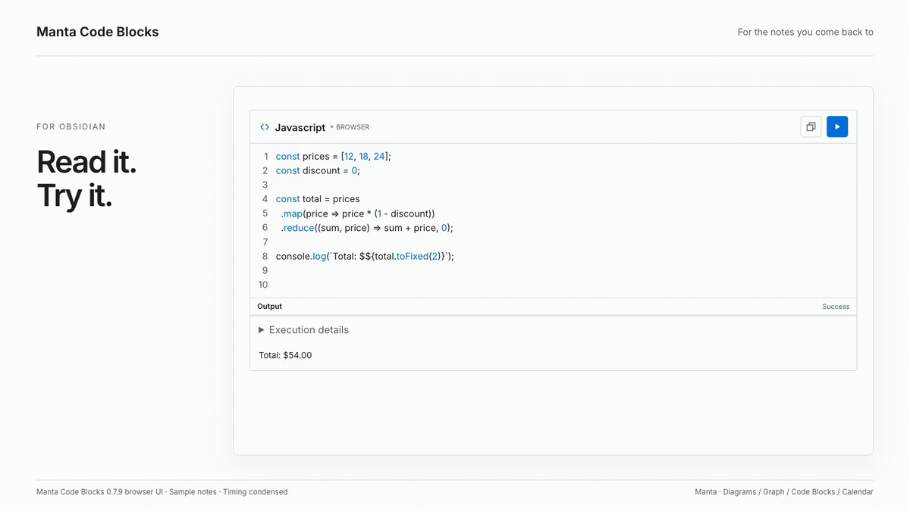

# Manta Code Blocks

Edit and run code without leaving your notes.

**[Install in Obsidian](https://community.obsidian.md/plugins/runnable-code-blocks) · [Try the live editor](https://woonyong-choi.github.io/manta-code-blocks/) · [User guide](docs/user-guide.md)**

Version: **0.7.10** · Obsidian **1.13.0+** · Desktop and mobile. See [release notes](CHANGELOG.md) for shipped changes and the [roadmap](ROADMAP.md) for work in progress and plans.

<picture>
  <source media="(prefers-color-scheme: dark)" srcset="docs/assets/manta-code-blocks-intro-dark.gif">
  
</picture>

A six-second loop of the current browser UI, with real JavaScript execution. Timing is condensed.

## Install and try

1. Open the [existing Community entry](https://community.obsidian.md/plugins/runnable-code-blocks) in Obsidian.
2. Select **Install**, then **Enable**.
3. Paste this block in a note, switch to Reading view, and select **Run**:

````markdown
```run-javascript
console.log("Hello from Obsidian!");
```
````

The result appears below the code. Edit the example and run again; **Copy** keeps your edited code, while **Reset** restores the original.

Seven browser fences work without an account or server. Other languages use an optional local companion or a named remote provider. Remote execution is enabled by default; disable it in settings to prevent remote submission.

Manual installation: download `main.js`, `manifest.json`, and `styles.css` from [Releases](https://github.com/woonyong-choi/manta-code-blocks/releases/latest) into `.obsidian/plugins/runnable-code-blocks/`, then reload Obsidian.

<details>
<summary>Original runtime capture and recorded version</summary>


Browser demo, September 9, 2026 (0.7.3); the capture predates the Manta name.

</details>

## Part of the Manta family

Explain the process with a diagram, try the example, follow related notes and return to its dated review. [Manta Diagrams](https://github.com/woonyong-choi/manta-diagrams), [Manta Graph](https://github.com/woonyong-choi/manta-graph), [Manta Calendar](https://github.com/woonyong-choi/manta-calendar) each work on their own. Ordinary notes and links connect the work today; automatic handoffs are planned.

**Manta itself is in development and has not been released.** I’m building it to turn source material into a personal wiki you can keep adding to. Shared AI tools and the full wiki workflow are still in development.

## Help and development

[User guide](docs/user-guide.md) · [Report a problem](https://github.com/woonyong-choi/manta-code-blocks/issues) · [Community page](https://community.obsidian.md/plugins/runnable-code-blocks) · [Contributing](CONTRIBUTING.md)

[MIT](LICENSE) · [Third-party notices](THIRD_PARTY_NOTICES.md)
